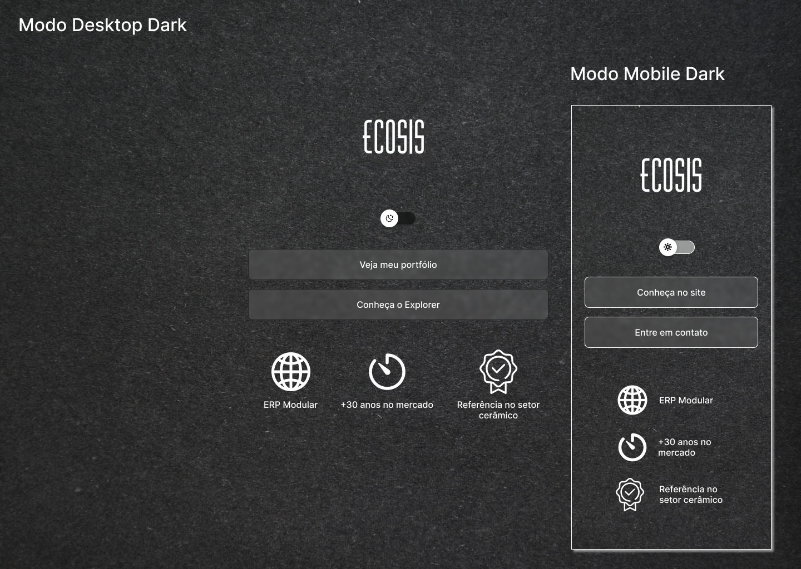
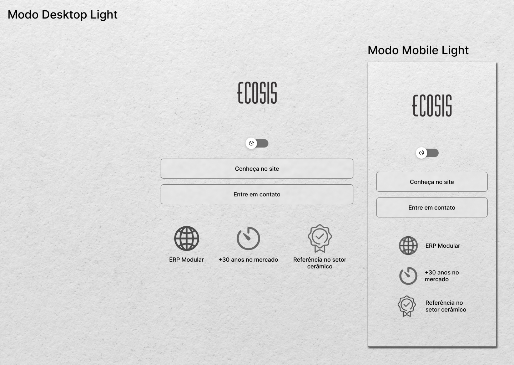

<h1 align="center">
  
  
</h1>

# projeto-rocketseat

Projeto desenvolvido no curso DISCOVER da Rocketseat.

Pagina contendo informacoes de contato e redes sociais, com a opcao de personalizar o tema da pagina. Modo light ou escuro.

Tecnologias utilizadas: HTML, CSS e Javascript

